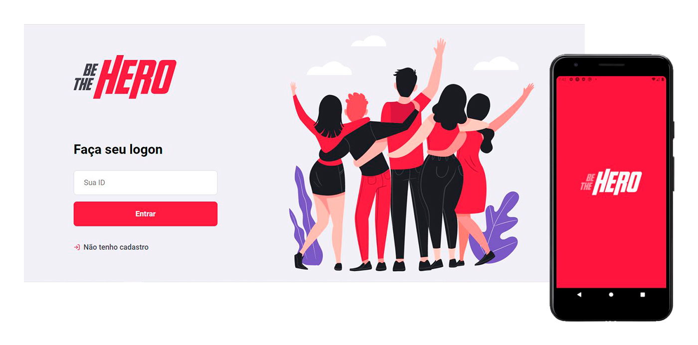

## **🚀 Project**

**Be The Hero** connects people who want to help a Non-Governmental Organization (NGO). On the platform, NGOs can create incidents with Pets that need help. Heroes can research all the incidents created and choose which one they want to help and contact the NGO.

## **💻 Developed with**

### **technologies**
 
- [Node.js](https://nodejs.org/en/)
- [React](https://reactjs.org/)
- [React Native](https://reactnative.dev/)
- [Expo](https://expo.io/)

&nbsp;

## **✔ It was also used:**

### 
- **dependencies**
- celebrate
- cors
- cross-env
- express
- knex
- sqlite3
- **devDependencies**
- jest
- nodemon
- supertest

&nbsp;

It was a project made on [Rocketseat](https://rocketseat.com.br/)'s #11 OmniStack Week.  

----

## License 📝

[MIT license](https://github.com/andersonalves1/Be-The-Hero/blob/master/LICENSE)